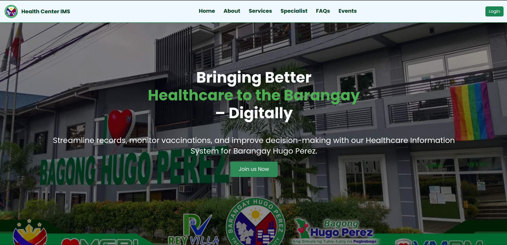
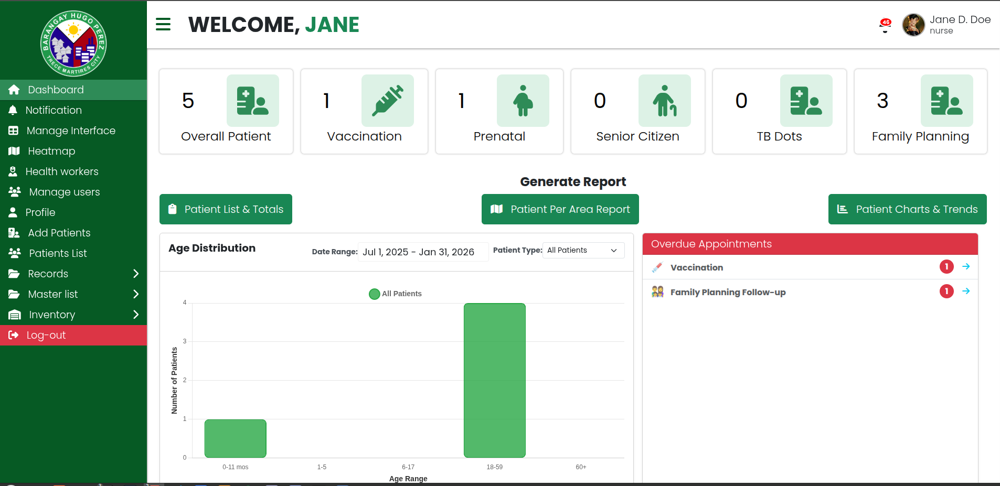

## Health Center Information Management System
## 📌 Project Description
The Health Center Information Management System (IMS) is a web-based application designed to digitalize and centralize patient medical records for a local health center.
It replaces manual, paper-based record keeping with a secure and efficient system that improves data accuracy, accessibility, and reporting for healthcare workers.
It notify the patient about their upcoming schedule and also notify the nurse, and healtworker about the scheduled and overdue patient to plan the prioritise.
It also includes a heatmap to provide data visualization of the patients and provide stategy and enable them to generate a plan which patient to prioritize.

The system supports multiple healthcare programs such as Vaccination, Pre-Natal Care, TB-DOTS, Senior Citizen care, and Family Planning, while providing role-based access for different users.
## Technology Used
- Laravel
- PHP
- JavaScript
- Css
- Leaflet
- SMTP (Gmail)
- Bootstrap
- MySQL
## ✨ Features
- **CRUD Operations**
  - Create, read, update, and delete medical records

- **Multi-user Roles and Authorization**
  - Nurse
  - Health Worker
  - Patient

- **Patient Dashboard**
  - View personal medical records
  - Receive in-app notifications
  - Receive email notifications via Gmail (SMTP)

- **Admin / Staff Dashboard**
  - View patient statistics and total counts
  - Data visualization using charts and heatmaps

- **Automated Masterlist Generation**
  - Consolidates records for reporting and monitoring

- **Real-time Record Updates**
  - Powered by Laravel Livewire

- **Report Generation**
  - Exportable and printable records

- **Secure Registration System**
  - Image-based code verification during registration

- **Email Notification System**
  - SMTP-based email delivery
# 🔄 System Process
1. **User Registration**
   - Users register using a verification code sent via image or email.

2. **Authentication & Authorization**
   - Users are granted access based on assigned roles and permissions.
3. **Health Worker Registration**
    - Nurse account will create the account of the health worker.
    - health worker account is responsible for handling the records.
3. **Record Management**
   - Health workers create and update patient medical records.
     
4. **Real-time Updates**
   - Changes are reflected instantly using Laravel Livewire.

5. **Patient Access**
   - Patients can view and download their medical records and receive notifications.

6. **Monitoring & Reporting**
   - Staff can view dashboards, generate masterlists, and export reports.
7. **Automated Masterlist Generation**
    - the system automate the generation of materlist record. it will based on the exisitng records.
    - health worker or nurse can view and generate the report
  
## 📚 What I Learned
- Personality this is my first laravel project and i learned a lot including MVC concepts, RESTful API, and livewire.
- Implementing role-based authorization in Laravel
- Implementing middleware
- Integrating SMTP email notifications
- Applying data visualization techniques (charts & heatmaps)
- Improving system security through controlled access and validation
- Building a system aligned with real-world healthcare workflows

## 🖼️ Preview
- **Home Page**
  
- **Dashboard Page**

